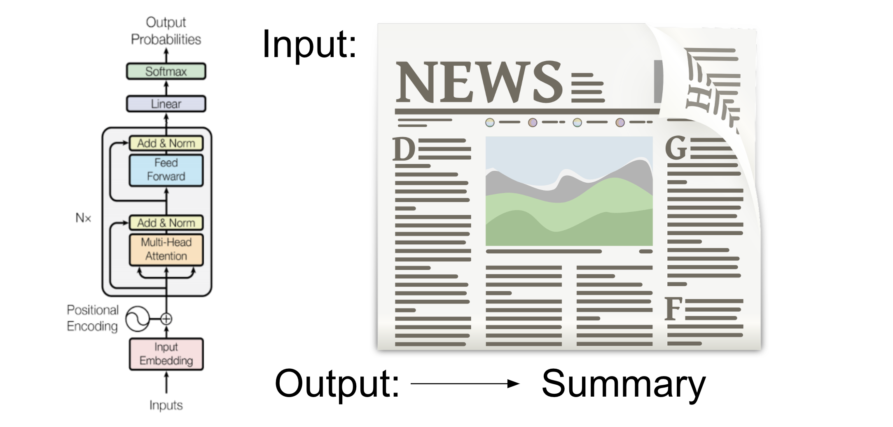

# summarization-using-the-transformer-GPT-2 using Trax

We will explore summarization using the transformer model. Yes, you will implement the transformer decoder from scratch, but we will slowly walk you through it.

## Anaconda environment

To set up the environment, execute in a terminal the followings:

* `conda create -n env1`
* `conda activate env1`
* `conda install pip`
* `pip install -r requirements-dev.txt`

# Summarization

Summarization is an important task in natural language processing and could be useful for a consumer enterprise. For example, bots can be used to scrape articles, summarize them, and then you can use sentiment analysis to identify the sentiment about certain stocks. Anyways who wants to read an article or a long email today, when you can build a transformer to summarize text for you. Let's get started, by completing this assignment you will learn to:  

- Use built-in functions to preprocess your data
- Implement DotProductAttention
- Implement Causal Attention
- Understand how attention works
- Build the transformer model
- Evaluate your model
- Summarize an article

As you can tell, this model is slightly different than the ones you have already implemented. This is heavily based on attention and does not rely on sequences, which allows for parallel computing. 